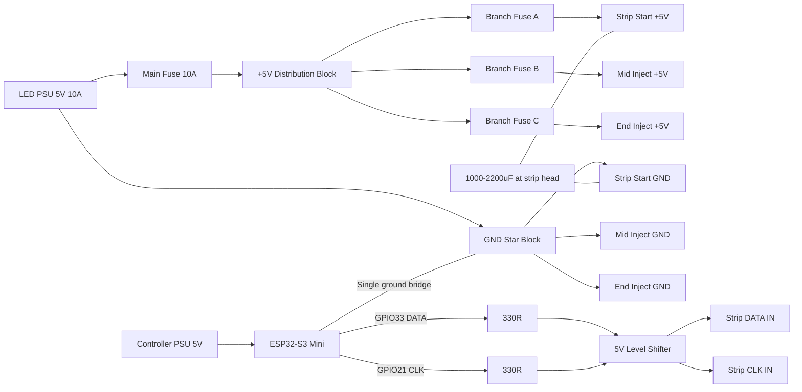

# LED Enclosure Setup - BOM & Architecture Guide

## Current System Overview
- **LED Type**: SK9822 (APA102-compatible), 177 units, BGR color order
- **Microcontroller**: ESP32 (Data pin 33, Clock pin 21)
- **Power Supply**: 10A
- **Transport Options**: Serial/BLE via NimBLE
- **Max Theoretical Current**: ~10.6A at full white (177 LEDs × 60mA)
- **Typical Operating Current**: 3-5A (at realistic brightness)

---

## Architecture Decision Matrix

| Factor | Single Enclosure | Distributed (Per-Strip) |
|--------|------------------|-------------------------|
| **Initial Cost** | $50-80 | $120-180 |
| **Complexity** | Low | Medium |
| **Wiring Length** | Long (voltage drop risk) | Short (power local) |
| **Fault Resilience** | Single point of failure | Isolated strip failures |
| **Scalability** | Limited | Highly extensible |
| **Connector Count** | 2-3 (PSU to controller, controller to strips) | 5-8 (PSU + strip returns) |
| **Heat Management** | Concentrated | Distributed |
| **Best For** | Fixed installation, lower budget | Modular/touring, future expansion |

### Recommendation
**Choose Single Enclosure if**: System is stationary and complete. Budget-conscious. Minimal LED strips (1-2).

**Choose Distributed if**: Planning to add/modify strips later. Want professional reliability. Have multiple distinct zones. Performance/touring context.

---

## Option 1: Single Enclosure Setup (Recommended for initial stabilization)

### Architecture
```
10A PSU → Enclosure [ESP32 + distribution board] → LED Strips
           └─ Backup capacitor, fuse, power conditioning
```

### BOM - Single Enclosure

#### Power & Protection
| Item | Qty | Spec | Cost | Source |
|------|-----|------|------|--------|
| **PTC Resettable Fuse** | 1 | 10A, 5V rated | $3 | Digikey/Mouser |
| **Elektrolytic Capacitor** | 2 | 1000µF, 16V | $6 | Amazon/Local electronics |
| **Schottky Diodes** | 4 | 20A, 40V (1N5822) | $2 | Electronics supply |
| **0.1µF Ceramic Capacitor** | 2 | For IC decoupling | $1 | |

#### Microcontroller & Logic
| Item | Qty | Spec | Cost | Source |
|------|-----|------|------|--------|
| **ESP32 DevKit** | 1 | Already owned | $0 | |
| **40-pin GPIO Header Set** | 1 | For breadboard/PCB | $2 | Amazon |
| **Protoboard/PCB Layout** | 1 | Perfboard or custom PCB | $5-20 | OSHPark/Seeed Studio |

#### Connectors & Wiring
| Item | Qty | Spec | Cost | Source |
|------|-----|------|------|--------|
| **5.5×2.1mm DC Power Connector** | 1 | Panel mount | $2 | Amazon |
| **JST XH 2.54mm (3-pin)** | 6-12 | For LED data/ground | $3 | Amazon (bulk pack) |
| **XT30 Connectors (optional upgrade)** | 2 | Heavy-duty, if data is critical | $4 | |
| **22 AWG Stranded Wire** | 50ft | Data/signal lines | $8 | Electronics supply |
| **14 AWG Stranded Wire** | 25ft | Power lines (red/black) | $8 | Electronics supply |
| **Heat Shrink Tubing** | Assorted | Multi-diameter pack | $5 | Amazon |

#### Enclosure
| Item | Qty | Spec | Cost | Source |
|------|-----|------|------|--------|
| **Plastic Enclosure** | 1 | Hammond 1554 or similar (200×120×75mm) | $15 | Digikey/Mouser |
| **DIN Rail (35mm)** | 1ft | For component mounting | $3 | Amazon |
| **Rubber feet/vibration isolators** | 4 | M3/M4 | $3 | Amazon |
| **Cable glands** | 2-3 | M12 or M16 for strain relief | $5 | Amazon |

#### Cooling & Misc
| Item | Qty | Spec | Cost | Source |
|------|-----|------|------|--------|
| **Small heatsink fan (12V)** | 1 | Optional, if hot | $8 | Amazon |
| **Thermal paste** | 1 | For ESP32 if fanged heatsink | $3 | Amazon |
| **Zip ties, silicone dampeners** | Pack | For cable management | $4 | Amazon |
| **Label maker tape, documentation sheet** | 1 | For labeling connectors | $2 | |

**Single Enclosure Total**: $90-130 (plus PSU already owned)

---

## Option 2: Distributed Multi-Enclosure Setup (Professional/Expandable)

### Architecture
```
10A PSU → Splitter/Distribution Controller
         ├─ Enclosure 1: ESP32 #1 + 50 LEDs
         ├─ Enclosure 2: Slave controller + 60 LEDs  
         ├─ Enclosure 3: Slave controller + 67 LEDs
         └─ Return power lines back to PSU ground
```

### BOM - Distributed Setup (3 enclosures)

#### Repeat Power/Protection (×3)
| Item | Qty | Spec | Cost | Source |
|------|-----|------|------|--------|
| **PTC Resettable Fuse** | 3 | 10A each | $9 | |
| **Elektrolytic Capacitor** | 6 | 1000µF, 16V | $18 | |
| **Schottky Diodes** | 12 | 20A, 40V | $6 | |

#### Microcontrollers
| Item | Qty | Spec | Cost | Source |
|------|-----|------|------|--------|
| **ESP32 DevKit Master** | 1 | Already owned | $0 | |
| **ESP32 DevKit Slaves** | 2 | Additional units | $25 | Amazon (bulk) |
| **i2c/BLE Synchronization Logic** | — | In firmware | $0 | |

#### Distribution Board (Central Hub)
| Item | Qty | Spec | Cost | Source |
|------|-----|------|------|--------|
| **Heavy-duty power distribution PCB** | 1 | 4+ solder pads for PSU split | $12 | OSHPark custom |
| **Bus bars (copper)** | 2 | +5V and GND rail | $5 | Electronics supply |
| **IEC C13 Inlet + Switch + Fuse** | 1 | Professional AC power inlet | $15 | Amazon/Digikey |

#### Connectors (Increased)
| Item | Qty | Spec | Cost | Source |
|------|-----|------|------|--------|
| **XT60 Connectors** | 10 | For robust power distribution | $12 | Amazon |
| **JST XH 3-pin (data)** | 12 | Per enclosure × 3 | $9 | |
| **Anderson SB120 or SB50** | 4 | Heavy-duty option (optional) | $20 | |
| **22 & 14 AWG Stranded Wire** | Bundle | Larger quantities | $25 | |

#### Enclosures (×3)
| Item | Qty | Spec | Cost | Source |
|------|-----|------|------|--------|
| **Plastic Enclosures** | 3 | Hammond 1554 (1 larger for hub, 2 standard) | $50 | Digikey |
| **DIN Rail, feet, cable glands** | Sets of 3 | Per enclosure | $20 | Amazon |

**Distributed Setup Total**: $210-280 (plus PSU + labor)

---

## Wiring & Power Distribution Best Practices

### Critical for Your 10A Setup
1. **Capacitor Placement**: 1000µF capacitor within **6 inches** of ESP32 power pins
2. **Multiple Ground Points**: Run GND from PSU to both LED strips AND back to PSU (not just to ESP32)
3. **Fusing**: Always fuse power line between PSU and enclosure at rated current (10A PTC fuse)
4. **Wire Gauge**: 
   - **14 AWG minimum** for +5V PSU → Enclosure (if >3ft run)
   - **22 AWG** for logic/data signals
   - **16 AWG** for return grounds from LED strips
5. **Voltage Drop Budget**: 
   - 177 LEDs at 5A = 0.25V acceptable drop
   - Run separate ground returns from each LED strip back to PSU (daisy-chain is risky)

### Safety Checklist
- [ ] PTC fuse rated ≥10A, ≤20A (auto-reset) OR ceramic fuse + manual reset
- [ ] All power connectors keyed/polarized to prevent reverse insertion
- [ ] Capacitor voltage rating ≥16V (not 10V)
- [ ] No single point of failure for ground connection
- [ ] LED strip grounds **NOT** daisy-chained if total >100 LEDs
- [ ] Heat-shrink tubing on every solder joint
- [ ] Label all connectors: +5V, GND, DATA, CLK with color tape

---

## Enclosure Layout Recommendations

### Component Mounting Order (Single Enclosure)
```
[Fuse] → [Capacitor Bank] → [Schottky diodes] → [Distribution screw terminals]
                                                        ↓
                        [ESP32 on DIN rail or PCB mount]
                        [Small protoboard for signal logic]
```

### Wire Entry Points
- **Bottom/Side**: PSU input (5.5×2.1mm connector) + input ground
- **Top/Side**: LED strip outputs (JST XH connectors) × 3-4
- **Back**: Ventilation gaps (natural convection minimal; active fan optional)

### Heat Dissipation
- Leave 1-2cm clearance around fuse & capacitor
- For active system (>6A sustained), add small **80mm 12V axial fan** on back
- Drill ventilation holes (3mm) 2cm from top corners

---

## Wiring Detail: Typical Configuration

```
PSU (10A, 5V)
├─ RED (+5V):  → 14AWG → Enclosure inlet → [PTC Fuse 10A] → [Capacitor +]
├─ BLACK (GND): → 16AWG → Enclosure inlet → Screw terminal
│                                              ↓
│                                    [ESP32: +5V, GND pins]
│                                              ↓
│                          [GPIO 33 data, GPIO 21 clock out]
│                                              ↓
│              [JST XH connectors: +5V, GND, Data, Clock]
│                            ↓              ↓
│                    [LED Strip 1]  [LED Strip 2]  etc.
│                            ↓              ↓
└─ BLACK (GND): ← 16AWG ← ← ← ← Daisy ground back to PSU GND
                             (DO NOT skip this step)
```

---

## Supplier Quick Links

### Primary Sources
- **Mouser.com**: Professional components, qty 1 OK, 2-3 day shipping
- **Digikey.com**: Extensive selection, fast shipping
- **Amazon.com**: Connector packs, wire, enclosures, fast delivery
- **AliExpress**: Budget connectors/wire, 4-6 week lead time
- **OSHPark.com** (PCB design): Custom perfboard cuts, $5-20 turnaround

### Specific Part Recommendations

**Enclosures**:
- Hammond 1554 (flanged, 200×120×75mm): Part #1554 on Mouser
- Serpac (polycarbonate, IP65): More expensive but more aesthetic

**Connectors - Favor these for current application**:
- XT30 (30A rated, keyed, compact): Amazon $8/pair
- Anderson SB50 (50A rated, professional): Digikey, more expensive but industry standard
- JST XH (2.54mm, cheap, fine for logic): Amazon $5 for 50 connectors

**Fuses**:
- Littelfuse PTC 10A: Mouser part #687-RXEF010
- Ceramic 10A with holder: Amazon, $3-5

---

## Implementation Steps

### Phase 1: Single Enclosure (Weeks 1-2)
1. Source enclosure, connectors, wire
2. Build power distribution board (solder PSU inlet, fuse, capacitor, screw terminals)
3. Mount ESP32 on DIN rail or PCB
4. Route wires with heat shrink, label thoroughly
5. Test with multimeter before connecting LEDs
6. Connect LED strips one at a time, verify each
7. Document final wiring with photos inside enclosure

### Phase 2: Add Modular Slave Enclosures (Optional, Weeks 3+)
1. Design i2c sync protocol for multi-ESP32 coordination
2. Build 2 additional enclosures with same layout
3. Create central distribution hub with XT60 connectors
4. Implement firmware handoff between masters

---

## Testing Checklist (Before Live Use)

- [ ] Multimeter check: +5V at esp32 pins (with no LEDs connected)
- [ ] Continuity check: All ground loops closed properly
- [ ] Load test: Connect 1 LED strip, run at 50% brightness × 5 min (measure PSU amp draw)
- [ ] Thermal check: Measure capacitor and fuse temp (should feel cool to touch)
- [ ] Stress test: Run full 177 LEDs at 100% white for 10 seconds (peak current)
- [ ] Measure: Voltage sag at LED end under full load (should be <0.3V drop)
- [ ] Power cycle: Disconnect/reconnect PSU 5 times (fuse and capacitor should handle transients)

---

## Cost Summary

| Option | Total Cost | Sourcing Time | Setup Time | Scalability |
|--------|-----------|---------------|-----------|------------|
| **Single Enclosure** | $90-130 | 2-3 days (with Prime) | 3-4 hours | Low |
| **Distributed (3×)** | $210-280 | 1 week | 8-10 hours | High |

---

## Recommendations for Your Use Case

1. **Start with Single Enclosure** — stabilize current setup, reduce fragility immediately.
2. **Use XT30 connectors minimum** — much safer than bare wire or basic JST.
3. **Route GND separately from each strip** — do not daisy-chain ground on 177-LED system.
4. **Add active cooling** if sustained power draw >5A — ESP32 can throttle under thermal stress.
5. **Document everything inside enclosure** — wiring diagram, component ratings, BLE address label.
6. **Plan for future**: Leave extra screw terminals in hub for Phase 2 slave enclosures.

---

## Wiring Diagram (Dual PSU: Controller + LED Power)

Use this when the ESP32 has its own supply and the LEDs have a separate 5V high-current supply.

### Block Diagram



### Physical Wiring (Build Order)

1. LED PSU positive to main 10A fuse, then to +5V distribution block.
2. LED PSU ground to GND star block.
3. From +5V block, run fused branches to strip start/mid/end injection points.
4. From GND star block, run matching ground branches to each injection point.
5. Power ESP32 from controller PSU only.
6. Add one dedicated ground bridge from ESP32/controller ground to LED GND star block.
7. Route DATA and CLK from ESP32 through 330R series resistors and a 5V level shifter to the first strip input.
8. Place 1000-2200uF capacitor across +5V/GND at strip head input.

### Terminal Label Map (Suggested)

```text
TB1  (LED +5V Distribution)
   TB1-1: +5V IN (from main fuse)
   TB1-2: +5V OUT A -> Strip Start +5V (fused)
   TB1-3: +5V OUT B -> Mid Inject +5V (fused)
   TB1-4: +5V OUT C -> End Inject +5V (fused)

TB2  (GND Star)
   TB2-1: GND IN (from LED PSU)
   TB2-2: GND OUT A -> Strip Start GND
   TB2-3: GND OUT B -> Mid Inject GND
   TB2-4: GND OUT C -> End Inject GND
   TB2-5: GND Bridge -> ESP32/Controller GND

TB3  (Signal Header to Strip Head)
   TB3-1: GND (paired with signal)
   TB3-2: DATA (from shifter, GPIO33 path)
   TB3-3: CLK  (from shifter, GPIO21 path)
```

### Minimum Wire Gauge

- LED PSU to TB1/TB2: 14 AWG
- TB1/TB2 to injection points: 16 AWG (14 AWG if long run)
- Ground bridge (TB2 to ESP32 GND): 18 AWG minimum (16 AWG preferred)
- DATA/CLK: 22 AWG

### Safety Notes

- Keep controller 5V and LED 5V rails separate.
- Common ground is required; no common ground means unstable/noisy data.
- Put fuses near source side, not at strip end.
- Do not daisy-chain all ground return through a single thin wire.

---

## Next Steps
- Confirm which LED strips you currently have (need exact amp rating if available)
- Decide: Single vs. Distributed architecture
- Order enclosure + connectors as priority items (everything else can be added later)
- I can help with circuit diagrams or PCB layout if needed

---

## One Enclosure + Built-In Battery + Two Strip Outputs

This is a good approach if you want clean stage setup and fewer external boxes.

### Recommended Power Topology

Use a true charger plus power-path design, not a simple charger board directly feeding load.

Power chain:

1. DC input jack (for wall adapter)
2. Charger + power-path board (supports charge while running)
3. Battery pack with BMS
4. 5V buck converter sized for full LED + controller load
5. Main fuse near buck output
6. Two fused strip outputs + one ESP32 power branch

Single-feed rule:

- One power entry at the head of each strip only
- No mid-strip or end-strip power injection
- Keep one connector per strip carrying both power and signal

Notes:

- For high LED current, 2S or 3S battery architecture is usually better than 1S + high-current boost.
- Size buck converter for at least 8A continuous if you keep software amp limiting around 3A to 5A total.
- Keep software current limiting enabled in the app to control heat and runtime.

### Connector Strategy (Your 4-pin + 3-pin Question)

If both strips are SK9822/APA102 type, each strip needs 4 wires:

- +5V
- GND
- DATA
- CLK

Decision (recommended): standardize enclosure outputs to 4-wire for both channels.

- OUT A uses 4-wire connector
- OUT B uses 4-wire connector
- 3-wire strips connect using a short 4-wire-to-3-wire adapter harness

A 3-pin connector is only valid for one-wire strips (for example WS2812/SK6812) that do not use a clock line.

So you have two clean choices:

1. Keep mixed connectors only if strip types are actually different:
   - Strip A (SK9822): 4-pin
   - Strip B (one-wire): 3-pin

2. Standardize and replace connectors (recommended):
   - Use one connector family for both outputs
   - If both are SK9822, use 4-pin for both

Adapter policy for 3-wire strips:

- Keep enclosure pinout fixed as +5V, GND, DATA, CLK
- In the adapter, map +5V, GND, DATA through
- Leave CLK disconnected (NC) on the 3-wire side
- Add a clear tag on adapter: "3-wire adapter: CLK not used"

### Best Practical Connector Upgrade

For your latest requirement (one power input for the whole strip), use one combined 4-wire locking connector per strip output.

Recommended 4-wire connector families:

- GX12-4 (panel metal aviation connector)
- M8 4-pin A-coded (compact and robust)
- JST-VH 4-pin only if current is kept low and wiring is short

Avoid JST-SM for higher current paths if possible.

### Output Labels for Front Panel

Suggested labels:

- OUT A 4W: +5V / GND / DATA / CLK
- OUT B 4W: +5V / GND / DATA / CLK

If you choose a single 4-pin connector per output instead of split power/signal pairs, use this exact pin order on both outputs:

- Pin 1: +5V
- Pin 2: GND
- Pin 3: DATA
- Pin 4: CLK

For 3-wire strips via adapter:

- 4-pin Pin 1 (+5V) -> 3-pin +5V
- 4-pin Pin 2 (GND) -> 3-pin GND
- 4-pin Pin 3 (DATA) -> 3-pin DATA
- 4-pin Pin 4 (CLK) -> No connection

This avoids ambiguity when swapping strips.

### Diagram Source

Import/edit this architecture from:

- diagrams/single_enclosure_battery_dual_strip.mmd

